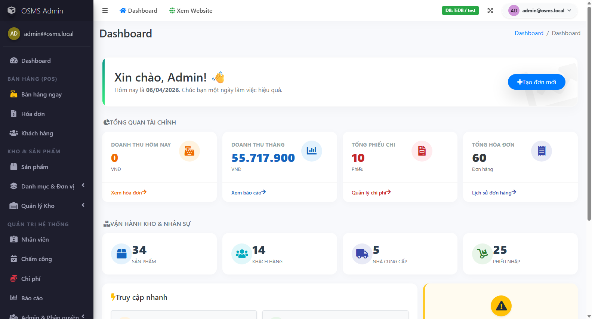
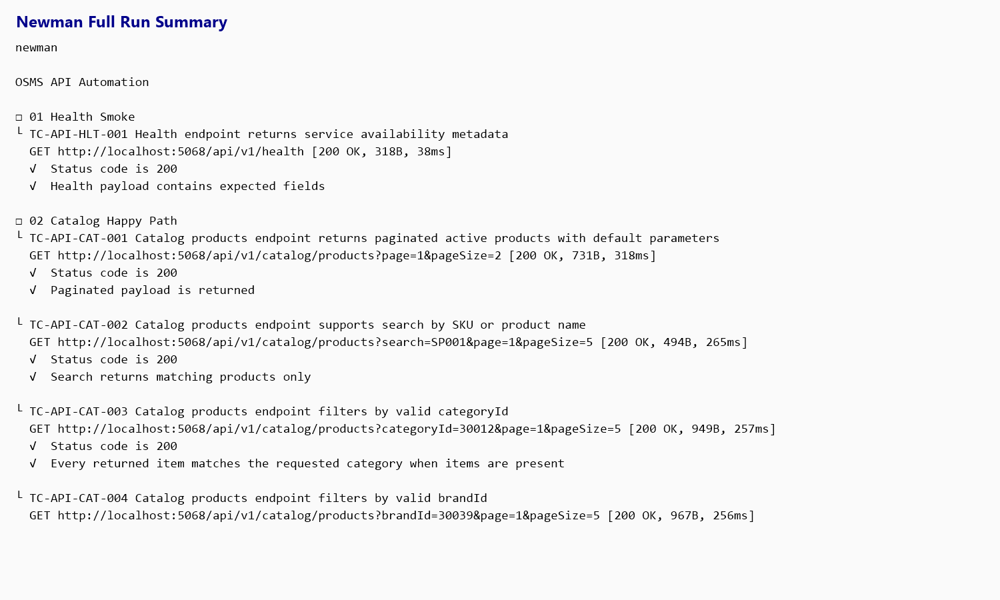
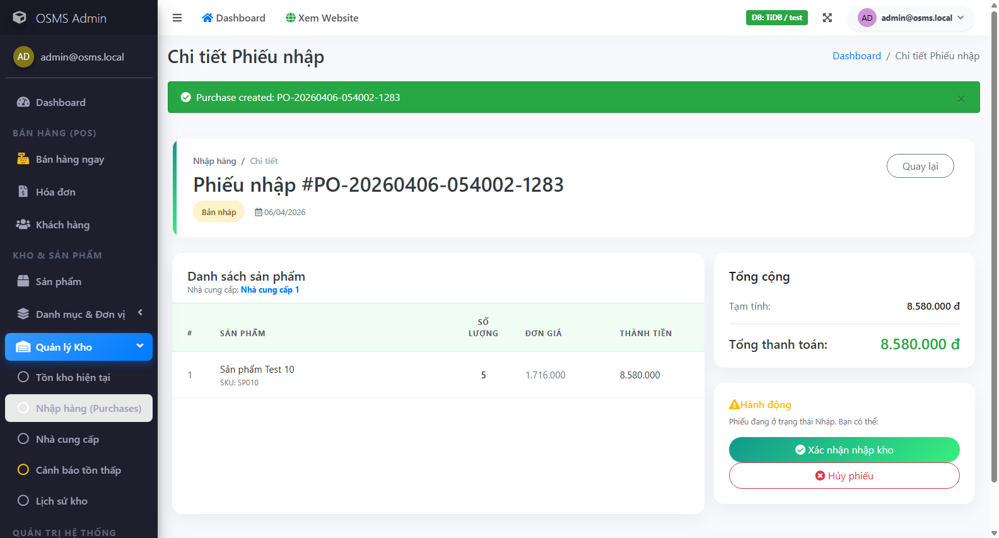
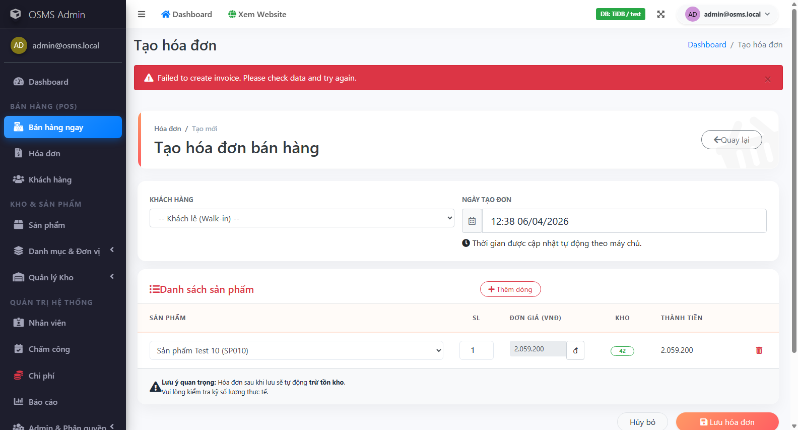
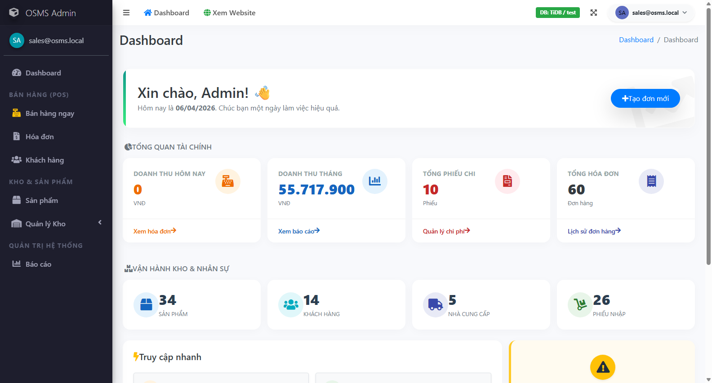
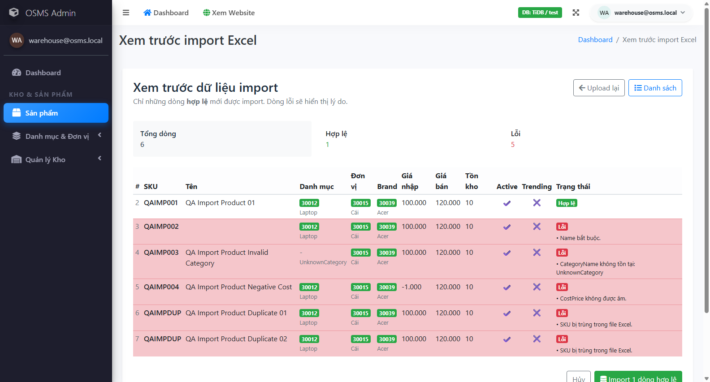
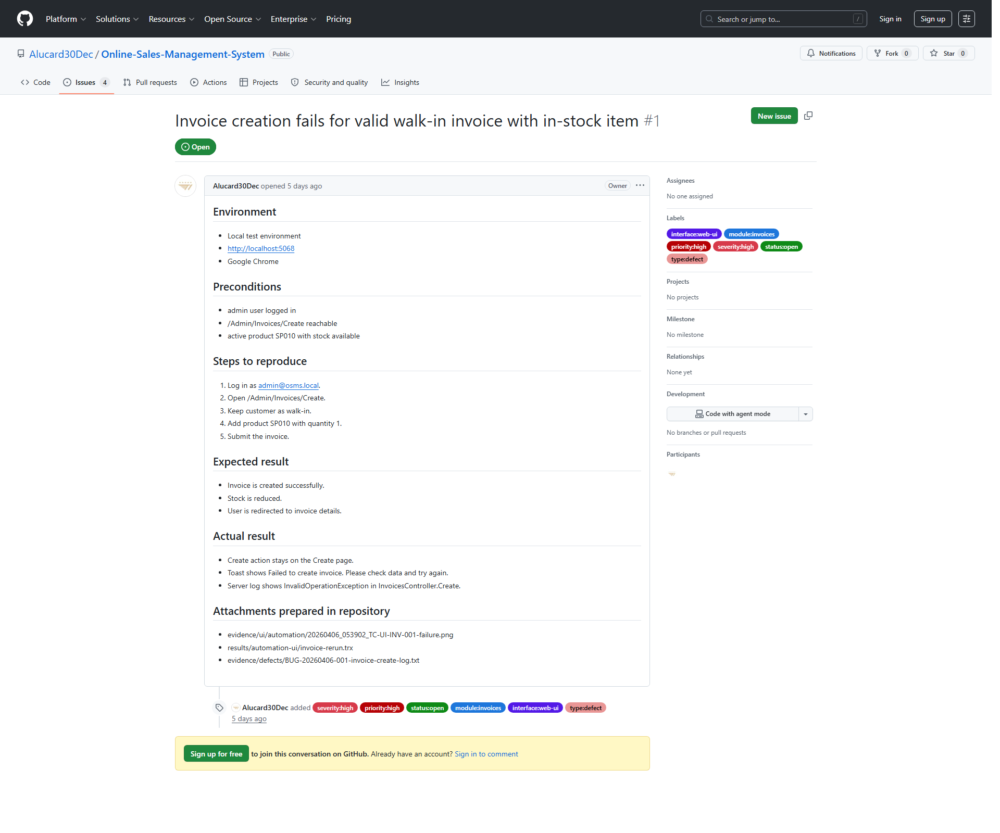
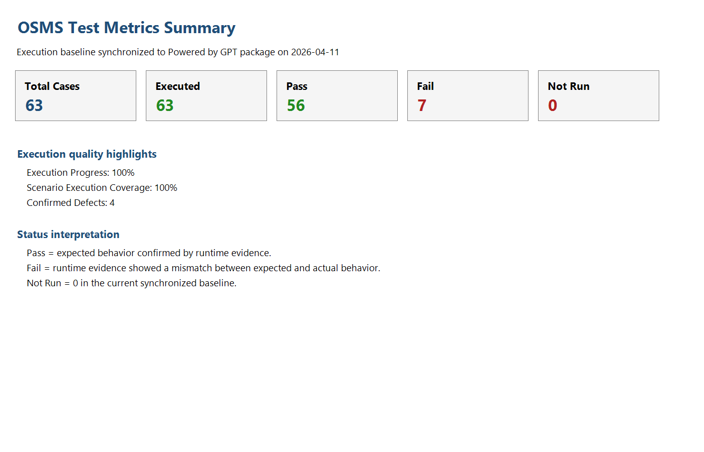

# Powered by GPT - Software Quality Verification

## Package Note

This Markdown file is the authoring source copied into the clean submission package. The canonical deliverables for grading are:

- `../Powered by GPT - Software Quality Verification - Final Report.docx`
- `../Powered by GPT - Software Quality Verification - Final Report.pdf`

If any path below still uses the original workspace naming, resolve it through `../Submission-Index.md`.

## Formatting Note

Apply the following formatting in the final Word document:

- font: `Times New Roman`
- font size: `12 pt` for body, `14 pt` for main headings
- line spacing: `1.5`
- standard margins
- automatic table of contents using Word heading styles

## Cover Page Content

**Powered by GPT - Software Quality Verification**  
Final Report for Software Testing Course

- System Under Test: `Online Sales Management System`
- Repository: `https://github.com/Alucard30Dec/Online-Sales-Management-System`
- Appendix Link: `https://github.com/Alucard30Dec/Online-Sales-Management-System/tree/main/Report%20Test%20subject/SV00123-ATU-A01`
- Team:
  - Hoang Van Thien - `22D1ITE-SWE03` - `225051915`
  - Nguyen Thanh Dat - `22D1ITE-SWE03` - `225050896`
  - Le Quang Duy - `22D1ITE-SWE03` - `225051169`
- Submission Date: `April 11, 2026`

## Record Of Changes

| Version | Date | Author | Change Summary |
|---|---|---|---|
| `0.1` | `2026-04-05` | QA team | Completed project audit, submission structure, and test plan baseline |
| `0.5` | `2026-04-05` | QA team | Added UI test cases, API test cases, test data, and automation design |
| `0.8` | `2026-04-05` | QA team | Added automation implementation, execution evidence, defect workflow, and metrics |
| `1.0` | `2026-04-06` | Hoang Van Thien | Consolidated final report content, analysis, and appendix linkage |
| `1.1` | `2026-04-10` | QA team | Expanded verified UI execution evidence, refreshed metrics, and synchronized the report with the updated test case baseline |
| `1.2` | `2026-04-11` | QA team | Removed UI Not Run status through real execution, refreshed defect log, metrics, report, and slides |

## Table Of Contents

The exported DOCX and PDF should use the heading hierarchy below for navigation.

# I. Overview

## 1.1 Project Information

This report presents the final software-testing submission for the `Online Sales Management System`, an `ASP.NET Core MVC (.NET 8)` application that manages authentication, products, suppliers, customers, purchases, invoices, stock, reports, and a public product catalog. The project also exposes a small API surface for service health and public catalog access. The test submission was built directly from source-code inspection, seeded demo data, local execution, and evidence collected from the running application.

The main objective of this report is to verify whether the project behaves correctly for its business-critical workflows and whether the resulting artifacts satisfy the course rubric in test planning, test design, execution evidence, reporting quality, and automation readiness.

## 1.2 System Under Test

- Project name: `Online Sales Management System`
- Technology stack: `ASP.NET Core MVC (.NET 8)`, `EF Core`, `ASP.NET Identity`, `TiDB/MySQL`
- Test surfaces:
  - `Admin UI`
  - `Public Product Catalog`
  - `GET /api/v1/health`
  - `GET /api/v1/catalog/*`

## 1.3 Project Team And Task Allocation

The project was completed by a three-member QA team. Work allocation was designed so each member owned more than ten UI test cases and covered separate functional areas to avoid unnecessary overlap. `Hoang Van Thien` handled a slightly larger portion of the workload and also led the integration of planning, automation direction, and final report consolidation.

### Team allocation

- `Hoang Van Thien`
  - led project audit and final integration
  - owned `17` UI test cases
  - main modules: `Authentication`, `Permissions`, `Admin Users`, `Admin Groups`, `Invoices`, `Reports`, partial `Public Catalog`
- `Nguyen Thanh Dat`
  - owned `13` UI test cases
  - main modules: `Customers`, `Suppliers`, `Purchases`, partial `Stock`
- `Le Quang Duy`
  - owned `14` UI test cases
  - main modules: `Products`, `Product Import`, partial `Stock`, partial `Public Catalog`

This allocation satisfies the requirement that each member contributes at least ten test cases while keeping role ownership visible for defense and review.

| Member | Primary ownership | UI cases owned |
|---|---|---:|
| `Hoang Van Thien` | Authentication, permissions, admin, invoices, reports | `17` |
| `Nguyen Thanh Dat` | Customers, suppliers, purchases, partial stock | `13` |
| `Le Quang Duy` | Products, product import, partial stock, public catalog | `14` |

# II. Test Plan

## 2.1 Test Scope

The testing scope focused on the highest-risk business and control areas of the project:

- authentication and login validation
- role-based access control for `admin`, `sales`, and `warehouse`
- product and master-data management
- purchase creation, receiving, and cancellation
- invoice creation, payment flow, and cancellation
- stock visibility and movement history
- report filtering and summary totals
- public catalog browsing, filtering, sorting, and details
- health and catalog API behavior

The following items remained outside scope for this submission:

- performance and load testing
- deep security penetration testing
- mobile testing
- full responsive certification across multiple devices
- unrevealed write APIs outside the exposed public catalog and health endpoints

## 2.2 Test Strategy And Approach

The project used a mixed strategy of `manual testing`, `API testing`, and `targeted automation`. Manual testing was prioritized for broad business-rule coverage, permission behavior, validation feedback, and human verification of visible outcomes. API testing was used for stable request-response validation on the exposed endpoints. Automation was applied selectively to high-value flows to maximize bonus potential without overextending the scope into unstable or low-value areas.

Execution followed a `black-box` approach, while test design used `white-box-informed` analysis of the source code to identify hidden edge cases, validation rules, route behavior, and permission boundaries.

## 2.3 Test Environment

The verified execution environment was:

- OS: `Windows 11`
- Runtime: `.NET 8`
- Browser verified: `Google Chrome`
- Local base URL: `http://localhost:5068`
- Repository path: `E:\Project\Online-Sales-Management-System`
- Database environment tag observed in UI: `TiDB / test`

The test data environment relied on seeded demo data from `Data/DbSeeder.cs`, including valid accounts, products, suppliers, customers, purchases, invoices, expenses, and stock movement records.

## 2.4 Tools Used

- planning and traceability: Markdown + Excel-compatible CSV/XLSX artifacts
- UI testing: manual browser testing + `Selenium WebDriver` with `.NET 8` and `xUnit`
- API testing: `Postman` and `Newman`
- bug management preparation: `GitHub Issues` taxonomy and defect register
- evidence and metrics: screenshots, TRX runner output, Newman output, CSV/XLSX metrics packs

| Item | Value |
|---|---|
| Operating system | `Windows 11` |
| Runtime | `.NET 8` |
| Primary browser | `Google Chrome` |
| Base URL | `http://localhost:5068` |
| Database tag | `TiDB / test` |
| Repository path | `E:\Project\Online-Sales-Management-System` |

# III. Test Design And Execution

## 3.1 Test Scenario Design

The scenario design phase identified `42` documented scenarios across UI and API surfaces. These scenarios were grouped by module and risk type, including positive flows, negative flows, validation flows, permission checks, and business-rule edge cases. The design intentionally emphasized critical modules such as authentication, permissions, purchases, invoices, stock, reports, and product import.

At the current stage, all `42` documented scenarios are represented in the current test-case files, which gives a scenario design coverage of `100%`. This closes the earlier traceability gap and strengthens the design section against rubric checks for completeness and coverage.

| Scenario metric | Value |
|---|---:|
| Documented scenarios | `42` |
| Scenarios mapped to test cases | `42` |
| Scenario design coverage | `100%` |
| Scenarios with execution evidence | `42` |
| Scenario execution coverage | `100%` |

## 3.2 UI Test Case Design

The UI test suite contains `44` test cases covering:

- authentication
- permissions
- admin users and admin groups
- customers
- suppliers
- products
- product import
- purchases
- invoices
- stock
- reports
- public catalog

Each UI test case includes:

- Test Case ID
- Scenario ID
- Title
- Module
- Preconditions
- Test Data
- Steps
- Expected Result
- Actual Result
- Status
- Owner
- Evidence / Note

The test cases were written to maximize clarity, reproducibility, and rubric coverage. Negative cases were prioritized for authentication, permissions, validation, duplicate inputs, import restrictions, and inventory-related workflows. In the current synchronized package, every UI case now has runtime evidence and no UI row remains in `Not Run`.

| Test Case ID | Module | Preconditions | Expected Result | Actual Result | Status |
|---|---|---|---|---|---|
| `TC-UI-AUTH-001` | Authentication | App is running; seeded admin account exists | Admin user reaches dashboard after valid login | Focused rerun reached the admin dashboard successfully | `Pass` |
| `TC-UI-PUR-001` | Purchases | Warehouse or admin is logged in; valid supplier and product exist | Draft purchase is created and redirects to details page | Draft purchase was created successfully and redirected to details page | `Pass` |
| `TC-UI-INV-001` | Invoices | Sales or admin is logged in; in-stock product exists | Invoice is created successfully and stock is reduced | Create action failed and returned to the form with error toast; server log confirmed backend exception | `Fail` |

## 3.3 API Test Case Design

The API test suite contains `19` cases mapped to the real endpoints found in the source code:

- `GET /api/v1/health`
- `GET /api/v1/catalog/products`
- `GET /api/v1/catalog/products/{id}`
- `GET /api/v1/catalog/trending`
- `GET /api/v1/catalog/filters`

The API cases cover:

- smoke validation
- happy-path catalog queries
- validation and negative inputs
- boundary values
- detail retrieval
- not-found behavior
- lookup endpoints

The API workbook also includes an `Evidence / Note` column so each API case can point back to the Newman text output and XML runner artifact used for execution proof.

All API cases were derived from real routes only. No undocumented endpoint was added.

| Test Case ID | Endpoint | Expected Status | Expected Result | Actual Result | Status |
|---|---|---:|---|---|---|
| `TC-API-HLT-001` | `GET /api/v1/health` | `200` | Health payload contains `status`, `service`, `serverTimeUtc`, `version` | Newman full run passed all health assertions | `Pass` |
| `TC-API-CAT-004` | `GET /api/v1/catalog/products?brandId=30039&page=1&pageSize=5` | `200` | Returned items match `brandId=30039` or empty array without error | Request passed all Newman assertions in full run | `Pass` |
| `TC-API-CAT-012` | `GET /api/v1/catalog/products?sort=popularity&page=1&pageSize=5` | `400` | Validation error indicates unsupported sort option | Request returned expected validation status and passed Newman assertions | `Pass` |

## 3.4 Test Data

The project uses seeded credentials and curated datasets to avoid generic placeholder data. Real reusable test data includes:

- valid seeded accounts for `admin`, `sales`, and `warehouse`
- invalid credential combinations
- category, brand, and product identifiers observed from the running system
- API query variations for positive and negative requests
- product import workbooks with mixed-validation rows
- invalid upload samples for attachment and file-format testing

Sensitive live credentials were not committed. Only demo-safe seeded data and controlled testing datasets were included in the repository.

| Data group | Real source | Purpose |
|---|---|---|
| Seeded admin accounts | `admin@osms.local`, `sales@osms.local`, `warehouse@osms.local` | Auth, permission, purchase, invoice, report, and stock flows |
| Negative credentials | fake password / unknown email / inactive account placeholder | Invalid login and inactive-account scenarios |
| UI business data | prepared supplier, product, import, and form values | CRUD, purchase, invoice, and import execution |
| API query data | real category, brand, product IDs and negative query variations | Health and catalog API validation coverage |

## 3.5 Automation Design And Implementation

To improve rubric score and bonus potential, a limited automation scope was implemented with maintainability in mind:

- UI automation stack: `.NET 8 + xUnit + Selenium WebDriver`
- API automation stack: `Postman + Newman`
- design pattern: `Page Object Model`
- reusable support layer for:
  - configuration
  - CSV test-data loading
  - waits
  - screenshots
  - webdriver management

The selected UI automation flows were:

- admin login smoke
- sales access-denied navigation
- privileged-user draft purchase creation
- privileged-user invoice creation
- product import preview

The selected API automation groups were:

- health smoke
- catalog happy path
- catalog validation and negative cases
- product detail
- trending and filters

| Automation surface | Implemented items | Evidence type |
|---|---|---|
| UI Selenium + xUnit | login smoke, permission denial, purchase draft creation, invoice creation, import preview | screenshots + TRX |
| API Postman + Newman | health, catalog list/detail, validation, trending, filters | Newman text output + XML |
| Reusable design | page objects, waits, screenshot helper, CSV loader, WebDriver factory | source code in `TestScript-Data/Automation/` |

## 3.6 Execution Summary

As of `2026-04-11`, the synchronized execution baseline now covers all designed UI and API cases with real runtime evidence:

- total test cases: `63`
- executed: `63`
- pass: `56`
- fail: `7`
- blocked: `0`
- not run: `0`
- execution progress: `100%`

The strongest confirmed pass results now include:

- `TC-UI-AUTH-001`, `TC-UI-AUTH-002`, `TC-UI-AUTH-004`, `TC-UI-AUTH-005`, and `TC-UI-AUTH-006`
- `TC-UI-ADM-001` and `TC-UI-ADM-002`
- `TC-UI-CUS-001`, `TC-UI-CUS-002`, and `TC-UI-CUS-003`
- `TC-UI-SUP-001`
- `TC-UI-PRD-001`, `TC-UI-PRD-002`, `TC-UI-PRD-003`, `TC-UI-PRD-004`, `TC-UI-PRD-005`, and `TC-UI-PRD-006`
- `TC-UI-IMP-001`, `TC-UI-IMP-002`, and `TC-UI-IMP-004`
- `TC-UI-PUR-001`, `TC-UI-PUR-004`, `TC-UI-PUR-005`, `TC-UI-PUR-006`, and `TC-UI-PUR-007`
- `TC-UI-INV-002` and `TC-UI-INV-004`
- `TC-UI-STK-001`, `TC-UI-STK-002`, and `TC-UI-STK-003`
- `TC-UI-REP-001` and `TC-UI-REP-002`
- `TC-UI-PUB-001`, `TC-UI-PUB-002`, and `TC-UI-PUB-003`
- all `19` API cases - full Newman collection pass

The current confirmed fail results are:

- `TC-UI-INV-001`, `TC-UI-INV-003`, and `TC-UI-INV-006`
  - linked root defect: `BUG-20260406-001`
  - invoice creation fails before reaching the intended business validation because of the known transaction defect
- `TC-UI-INV-005`
  - linked defect: `BUG-20260411-004`
  - invoice cancellation fails and stock is not returned
- `TC-UI-IMP-003`
  - linked defect: `BUG-20260411-003`
  - valid preview confirmation still fails during import commit
- `TC-UI-PUR-002` and `TC-UI-PUR-003`
  - linked defect: `BUG-20260411-002`
  - purchase validation banner renders without readable text for two required-input scenarios

| Final result summary | Value |
|---|---:|
| Total test cases | `63` |
| Executed | `63` |
| Pass | `56` |
| Fail | `7` |
| Blocked | `0` |
| Not Run | `0` |
| Execution progress | `100%` |

| Additional metrics | Value |
|---|---:|
| Pass rate on executed cases | `88.89%` |
| Fail rate on executed cases | `11.11%` |
| Scenario count | `42` |
| Mapped scenarios | `42` |
| Executed scenarios | `42` |
| Scenario execution coverage | `100%` |
| Confirmed defects | `4` |

## 3.7 Execution Evidence

The current evidence set proves that both UI and API automation are functioning beyond a smoke-only baseline and now supports full case-level execution traceability:

- UI evidence
  - login success screenshot exists for `TC-UI-AUTH-001`
  - permission-denial behavior screenshot exists for `TC-UI-AUTH-003`
  - import preview-count screenshot exists for `TC-UI-IMP-002`
  - purchase details screenshot exists for `TC-UI-PUR-001` and `TC-UI-PUR-007`
  - invoice failure screenshot exists for `TC-UI-INV-001`
  - extended execution screenshots now exist for admin users, customers, reports, stock, public catalog, and additional invoice, purchase, and product-import scenarios
- API evidence
  - full Newman collection output exists for all `19` API requests
- server-log evidence
  - extracted defect log exists for `BUG-20260406-001`

Figure E-1. Admin login success evidence.

Figure E-2. Newman full-run summary snippet.

Figure E-3. Draft purchase creation success evidence.

Figure E-4. Invoice creation failure evidence.

Figure E-5. Permission-denial redirect evidence for sales user.

Figure E-6. Product import preview-count evidence.

# IV. Defect Report And Metrics

## 4.1 Defect Log

At the current reporting date, the repository contains `4` confirmed product defects and `0` open observations pending manual confirmation. The two older automation observations remain closed after focused reruns proved that they were automation or expectation issues rather than product defects.

Current confirmed defect records:

- `BUG-20260406-001`
  - related to `TC-UI-INV-001`, `TC-UI-INV-003`, and `TC-UI-INV-006`
  - module: `Invoices`
  - severity / priority: `High / High`
  - current state: `Open - Confirmed`
  - GitHub Issue: `#1`
  - GitHub URL: `https://github.com/Alucard30Dec/Online-Sales-Management-System/issues/1`
  - evidence:
    - UI failure screenshot
    - focused rerun TRX
    - extracted server log excerpt showing `InvalidOperationException` in `InvoicesController.Create`
    - GitHub Issue screenshot with labels
- `BUG-20260411-002`
  - related to `TC-UI-PUR-002` and `TC-UI-PUR-003`
  - module: `Purchases`
  - severity / priority: `Medium / Medium`
  - current state: `Open - Confirmed`
  - evidence:
    - two UI failure screenshots
    - focused rerun TRX proving the validation banner is blank
- `BUG-20260411-003`
  - related to `TC-UI-IMP-003`
  - module: `Product Import`
  - severity / priority: `High / High`
  - current state: `Open - Confirmed`
  - evidence:
    - import-confirm failure screenshot
    - focused rerun TRX proving the valid preview still fails on confirm
- `BUG-20260411-004`
  - related to `TC-UI-INV-005`
  - module: `Invoices`
  - severity / priority: `High / High`
  - current state: `Open - Confirmed`
  - evidence:
    - invoice-cancel failure screenshot
    - focused rerun TRX proving cancellation does not complete

| Record ID | Type | Related Test Case | Current Status | Evidence state |
|---|---|---|---|---|
| `OBS-20260405-001` | Observation | `TC-UI-AUTH-003` | `Closed - Behavior Confirmed` | rerun proved redirect-based denial is expected |
| `OBS-20260405-002` | Observation | `TC-UI-IMP-002` | `Closed - Automation Fixed` | rerun proved import preview works after locator fix |
| `BUG-20260406-001` | Confirmed Defect | `TC-UI-INV-001`, `TC-UI-INV-003`, `TC-UI-INV-006` | `Open - Confirmed` | UI screenshots, TRX, server log, and GitHub Issue `#1` |
| `BUG-20260411-002` | Confirmed Defect | `TC-UI-PUR-002`, `TC-UI-PUR-003` | `Open - Confirmed` | UI screenshots and rerun TRX |
| `BUG-20260411-003` | Confirmed Defect | `TC-UI-IMP-003` | `Open - Confirmed` | UI screenshot and rerun TRX |
| `BUG-20260411-004` | Confirmed Defect | `TC-UI-INV-005` | `Open - Confirmed` | UI screenshot and rerun TRX |

Figure B-1. GitHub Issue evidence for the confirmed invoice defect.

## 4.2 Defect Management Workflow

The defect-management process was prepared using a GitHub-compatible workflow with explicit labels for:

- severity
- priority
- status
- module
- interface
- defect type

The intended workflow is:

1. execute or re-execute a related test case
2. classify the result as `Confirmed Defect`, `Observation`, or `Automation Script Failure`
3. open a GitHub Issue only after a defect is reproducible
4. attach screenshots, runner output, and expected-versus-actual details
5. retest before closure

| Label group | Values used |
|---|---|
| Severity | `severity:critical`, `severity:high`, `severity:medium`, `severity:low` |
| Priority | `priority:p1`, `priority:p2`, `priority:p3`, `priority:p4` |
| Status | `status:new`, `status:triaged`, `status:in-progress`, `status:ready-for-retest`, `status:closed`, `status:rejected` |
| Module | `module:auth`, `module:permissions`, `module:products`, `module:product-import`, `module:stock`, `module:purchases`, `module:invoices`, `module:reports`, `module:catalog-api`, `module:health-api` |
| Interface / type | `interface:ui`, `interface:api`, `interface:automation`, `type:defect`, `type:observation`, `type:automation-script` |

## 4.3 Test Summary Metrics

The current metrics show that the submission is structurally strong in planning, traceability, and execution completeness, while the main remaining weakness has shifted from coverage depth to unresolved defect count.

Key metrics:

- executed test cases: `63 / 63`
- pass rate on executed cases: `88.89%`
- fail rate on executed cases: `11.11%`
- blocked rate on executed cases: `0%`
- documented scenarios: `42`
- mapped scenarios: `42`
- scenario execution coverage: `100%`

Interface-wise view:

- `Admin UI`
  - total: `41`
  - executed: `41`
  - pass: `34`
  - fail: `7`
- `Public UI`
  - total: `3`
  - executed: `3`
  - pass: `3`
  - fail: `0`
- `API`
  - total: `19`
  - executed: `19`
  - pass: `19`

Module-wise view now shows that every module has direct execution evidence. The public API surface is fully executed and stable in the current baseline. `Invoices`, `Purchases`, and `Product Import` still contain the current confirmed defects, while the remaining modules are currently stable under the executed cases.

| Interface | Total | Executed | Pass | Fail | Not Run | Execution Progress % |
|---|---:|---:|---:|---:|---:|---:|
| `Admin UI` | `41` | `41` | `34` | `7` | `0` | `100` |
| `API` | `19` | `19` | `19` | `0` | `0` | `100` |
| `Public UI` | `3` | `3` | `3` | `0` | `0` | `100` |

| Module | Total | Executed | Pass | Fail | Not Run | Execution Progress % |
|---|---:|---:|---:|---:|---:|---:|
| `Authentication` | `3` | `3` | `3` | `0` | `0` | `100` |
| `Permissions` | `3` | `3` | `3` | `0` | `0` | `100` |
| `Purchases` | `7` | `7` | `5` | `2` | `0` | `100` |
| `Invoices` | `6` | `6` | `2` | `4` | `0` | `100` |
| `Product Import` | `4` | `4` | `3` | `1` | `0` | `100` |
| `Stock` | `3` | `3` | `3` | `0` | `0` | `100` |
| `Reports` | `2` | `2` | `2` | `0` | `0` | `100` |
| `Public Catalog` | `3` | `3` | `3` | `0` | `0` | `100` |

| Coverage status | Scenario count |
|---|---:|
| `Executed` | `42` |
| `Designed Only` | `0` |
| `Total` | `42` |

Figure M-1. Metrics summary exported from the workbook.

# V. Conclusion And Future Work

## 5.1 Achievements And Compliance

This submission achieved the following:

- completed a source-based project audit rather than a generic theory-based plan
- defined a structured test plan, scenario set, UI/API test cases, and reusable test data
- implemented a real automation framework for UI and API testing
- captured real execution evidence for both UI and API
- prepared a professional defect-management package and metrics pack
- maintained clear traceability between scenarios, test cases, results, evidence, and observations

## 5.2 Challenges And Limitations

The main limitation of the current package is no longer execution depth. All `63` designed test cases now have real runtime evidence. The remaining limitation is unresolved defect count: the system still contains four confirmed defects across invoices, purchases, and product import. All four defects are now mirrored into live GitHub Issues, and the invoice-create defect remains the strongest case because it also has server-log proof. Because of this, the report still cannot responsibly claim that the full system is stable.

The package still lacks two completions that would improve its final polish:

- focused defect retests were executed again on `2026-04-11`, and all four confirmed defects still reproduced without any status downgrade
- basic cross-browser evidence now exists through an `Edge` smoke rerun of `TC-UI-AUTH-001`

## 5.3 Future Enhancements

The highest-priority next actions are:

1. fix and retest the invoice-create defect tracked in GitHub Issue `#1`
2. fix and retest invoice cancellation, purchase validation rendering, and import confirm after fixes are available
3. refresh the defect log, final results workbook, and metrics pack after those post-fix retests
4. expand cross-browser evidence beyond the current `Edge` smoke proof if time permits

## 5.4 Final Conclusion

Based on the current execution evidence, the `Online Sales Management System` now has full case-level execution coverage across the designed UI and API test suite. The package is strong in test design, evidence traceability, and automation support, and it now avoids the earlier weakness of large `Not Run` sections. The automation evidence is also stronger because a basic `Edge` smoke rerun now confirms `TC-UI-AUTH-001` outside the primary Chrome baseline. However, the system still contains four confirmed defects, all mirrored into live GitHub Issues, and the invoice-create defect remains the strongest defect because it combines UI proof with server-log proof. Focused retests on `2026-04-11` showed that those four defects still reproduce, so the most defensible conclusion is that the project is execution-complete and submission-ready, but still short of a maximum-confidence quality claim until those confirmed defects are fixed and pass post-fix retest.

# References

1. `MainReport/UEF - Final.pdf`
2. `MainReport/SupportingDocs/phase-0-project-audit.md`
3. `MainReport/SupportingDocs/test-plan.md`
4. `MainReport/SupportingDocs/test-scenarios.md`
5. `MainReport/SupportingDocs/phase-7-automation-design.md`
6. `MainReport/SupportingDocs/phase-9-execution-and-evidence.md`
7. `MainReport/SupportingDocs/phase-10-defect-log-and-bug-management.md`
8. `MainReport/SupportingDocs/phase-11-final-results-and-metrics.md`
9. `MainReport/SupportingDocs/phase-12-analysis-and-insights.md`
10. Source repository: `https://github.com/Alucard30Dec/Online-Sales-Management-System`

# Appendix

## Appendix A. GitHub Submission Link

- `https://github.com/Alucard30Dec/Online-Sales-Management-System/tree/main/Report%20Test%20subject/SV00123-ATU-A01`

## Appendix B. Key Attached Artifacts

- Main report: `MainReport/Powered by GPT - Software Quality Verification - Final Report.docx`
- Final PDF: `MainReport/Powered by GPT - Software Quality Verification - Final Report.pdf`
- Presentation: `MainReport/Powered by GPT - Software Quality Verification - Presentation.pptx`
- UI test cases: `TestCases/UI/OSMS-UI-Test-Cases.xlsx`
- API test cases: `TestCases/API/OSMS-API-Test-Cases.xlsx`
- Scenario file: `TestCases/Scenarios/test-scenarios.md`
- Automation scripts: `TestScript-Data/Automation/`
- Test data: `TestScript-Data/TestData/`
- Final results: `TestResults/FinalResults/OSMS-Final-Test-Results.xlsx`
- Metrics: `TestResults/Metrics/OSMS-Test-Metrics.xlsx`
- Defect log: `TestResults/Defects/OSMS-Defect-Log.xlsx`
- UI evidence: `TestResults/Evidence/UI/automation/`
- API evidence: `TestResults/Evidence/API/newman-full-run.txt`
- Video: `Videos/OSMS-Automation-Demo.mp4`

## Appendix C. Remaining High-Value Execution Gaps

- Focused retests on `2026-04-11` confirmed that all four live defects still reproduce; true post-fix retest evidence is still required.
- Basic cross-browser evidence is now included through an `Edge` smoke rerun for `TC-UI-AUTH-001`.

